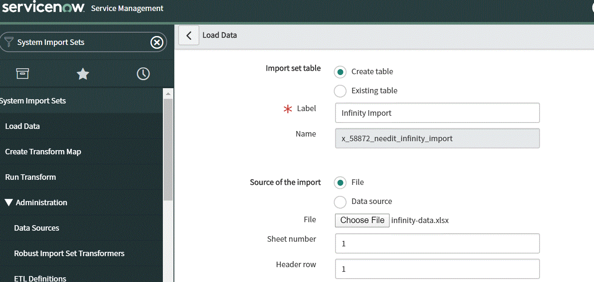

**Some info and suggest to public domain of hMailServer**

1. Set up account hmailserver in server

**Suggest:**

- Server need config SSL but it need key and certificate files, we used open ssl to do that on local. How about server? IT will do that with trust certificate?

- Suggest that system need public or do something to make sure client mail can access it from outsite for testing

- If public, please check domain name pcsotest.com is ok or any name? please advise

=============

("media/image1.png"){:target="_blank"}

=============

<a onclick="window.open('media/image1.png', '_blank', 'location=yes,height=570,width=520,scrollbars=yes,status=yes');">
  Share Page
</a>

=============

<a onclick="window.open('https://www.google.com', '_blank', 'location=yes,height=570,width=520,scrollbars=yes,status=yes');">
  Share Page
</a>
